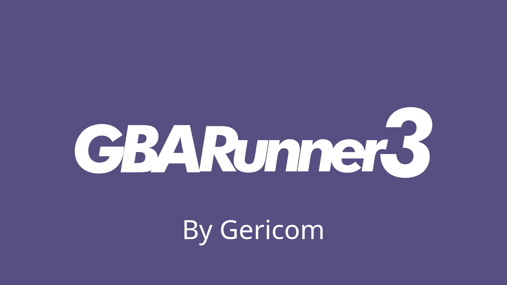

# GBARunner3




**GBARunner3** is the successor to [GBARunner2](https://github.com/Gericom/GBARunner2), designed as a hypervisor to run Game Boy Advance games on the **Nintendo DS in DS mode**, and on the **DSi/3DS in DSi mode**.

> **Note:** GBARunner3 is still in current development, experimental state, use it at your own risk.

While GBARunner2 began as a proof of concept and evolved into a large-scale project, it eventually suffered from maintainability and architectural limitations.
GBARunner3 aims to address these issues by providing a cleaner, more maintainable, and better-documented codebase, along with modern features and broader hardware support.

> **Note:** 3DS users should instead consider [open_agb_firm](https://github.com/profi200/open_agb_firm) to play GBA games.

## Table of Contents
- [Project Highlights](#project-highlights)
- [How to Compile](#how-to-compile)
- [Setup Instructions](#setup-instructions)
- [Configuration](#configuration-via-gbarunner3json)
- [Compatibility](#compatibility-list)
- [Troubleshooting](#troubleshooting)
- [Known Issues](#known-issues)
- [FAQ](#faq)
- [Contributing](#contributing)
- [Credits](#credits)


## Project Highlights

### Improvements Over GBARunner2

- Native SD card support for DSi and 3DS.
- Clean, maintainable and well-documented codebase.
- Compatible with modern devkitARM versions (pre-Calico).
- Better sound emulation on DS and DSi.
- Support for “hi-code” (higher ROM region execution up to 2MB).
- Real time and manual JIT patching for higher compatibility.
- Option to disable the unused screen for lower power usage.
- Have more control over the running game.

### Planned / Requested Features

- BlocksDS support.
- In-game Configuration menu.
- GBA Wireless Adapter emulation.
- True GBA color correction (multiple profiles).
- Real-Time Clock (RTC).
- GPIO Solar Sensor emulation.
- GPIO Rumble emulation.
- Save states and cheats.
- Sleep mode (via lid close or software).
- Auto IPS patching.
- Custom button remapping.

## How to Compile

1. Install **DevKitPro**, the version before 2.0 (Calico) is required.
2. Clone the repo with submodules:
   ```bash
   git clone --recursive https://github.com/Gericom/GBARunner3.git
   ```
3. Build from the `code` folder:
   ```bash
   cd code
   make
   ```
   Output will be `GBARunner3.nds` inside `/code/bootstrap`.

## Setup Instructions

### TwilightMenu++ Users

**Requirements:**
- [TwilightMenu++ v27.5.0+](https://github.com/DS-Homebrew/TWiLightMenu/releases)
- A valid GBA BIOS (see [this guide](https://wiki.ds-homebrew.com/gbarunner2/bios.html))

**Steps:**
1. Place your GBARunner3.nds in `/_nds/TWiLightMenu/emulators/`.
2. Place your GBA BIOS in `_gba/` renamed as `bios.bin`
3. Place the config folder in `_gba/configs/`
4. Launch TwilightMenu++ and navigate to your GBA ROMs location and launch them.
5. You should see the GBARunner3 splash animation, followed by the GBA BIOS animation with the Nintendo logo.

### Flashcart Kernel Users (via gbar3-frontend)

**Requirements:**
- [gbar3-frontend.nds](https://github.com/flashcarts/gbar3-frontend/releases)
- A valid GBA BIOS (see [this guide](https://wiki.ds-homebrew.com/gbarunner2/bios.html))

**Steps:**
1. Place your GBARunner3.nds in your SD card root.
2. Place your GBA BIOS in `_gba/` renamed as `bios.bin`
3. Place the config folder in `_gba/configs/`
4. Put `gbar3-frontend.nds` anywhere.
5. Launch `gbar3-frontend.nds`, navigate to your GBA ROMs location and launch them.
6. You should see the GBARunner3 splash animation, followed by the GBA BIOS animation with the Nintendo logo.

> Bonus feature: This frontend will automatically boot to `roms/gba` if it exists.

## Configuration via `GBARunner3.json`

<!-- 
TODO: Add direct feed screenshots and photos.
 -->

Example config file, needs to be stored inside `/_gba/GBARunner3.json`:
```json
{
  "runSettings": {
    "enableWramICache": true,
    "enableEwramDCache": true,
    "skipBiosIntro": false
  },
  "displaySettings": {
    "gbaScreen": "top",
    "gbaColorCorrection": "Agb001",
    "gbaScreenBrightness": 16,
    "enableCenterAndMask": true,
    "centerOffsetX": 8,
    "centerOffsetY": 16,
    "maskWidth": 240,
    "maskHeight": 160,
    "borderImage": "default"
  }
}
```

#### runSettings - Settings related to GBARunner3 "emulation" performance.
- `enableWramICache`: 
    - `[Boolean]` Enables WRAM instruction cache (disable it if the ROM uses self-modifying code).
- `enableEwramDCache`: 
    - `[Boolean]` Enables EWRAM data cache, fixes sound in some games.
- `skipBiosIntro`: 
    - `[Boolean]` Skips the GBA boot animation.

#### displaySettings - Settings related to how the Display is presented in GBARunner3.
- `gbaScreen`: Specifies the DS screen to display the GBA game on.
    - `"top"`
    - `"bottom"`
- `gbaColorCorrection`: Specifies the type of true color correction to use. Others may be added later.
    - `"Agb001"`: Resembles how the screen of the GBA (AGB-001) model looks.
    - `"none"`: No color correction is applied.
- `gbaScreenBrightness`: 
    - `1 ~ 16`, Specifies the master brightness setting to use for the display the GBA game on. Should be a value between 1 (darkest) and 16 (brightest).
- `enableCenterAndMask`: 
    - `[Boolean]` Hides the DS overscan, caused by GBARunner3 rendering games with DS resolution (adds 1 frame of latency).
- `centerOffsetX`: 
    - `0 ~ 8`, Horizontal centering offset to be used when enableCenterAndMask is true.
- `centerOffsetY`: 
    - `0 ~ 16`, Vertical centering offset to be used when enableCenterAndMask is true.
- `maskWidth`: 
    - `0 ~ 256`, 240 matches GBA screen width. Width of the visible screen area when enableCenterAndMask is true.
- `maskHeight`: 
    - `0 ~ 192`, 160 matches the GBA screen height. Height of the visible screen area when enableCenterAndMask is true.
- `borderImage`: Custom border image used when enableCenterAndMask is true.
    - `"default"`, needs to be `256x192 8bpp bmp`, renamed as `border.bmp` inside `_gba/` folder. 
    - `"game"`, needs to be renamed as the game internal ID (e.g. `BPEE.bmp`), and placed inside `_gba/borders`.
    - `"none"`, disables the Game Border.

#### gameSettings - Game related settings
- `saveType`: Specifies if game saving is performed.
    - `"Auto"`: Default, saving works as expected.
    - `"none"`: Used to bypass some AP measures.

### Per-game Settings
In addition to the global `GBARunner3.json` file, **per-game settings** are also supported.

To use per-game configurations:
- Create a separate JSON file for each game and place it in the `_gba/configs/` folder.
- Name the file using the game's **Title ID (TID)** and **Revision number (REV)** in the format:
```bash
TIDREV.json
```
- `TID` is the 4-character internal game code located at **0xAC** in the GBA ROM header.
- `REV` is the 1-byte revision number located at **0xBC** in the ROM header.

For example, if a ROM has:
- TID = `BPEE`
- REV = `01`

Then the config filename should be:
```bash
BPEE01.json
```
If no matching per-game config is found, GBARunner3 will fall back to the global `GBARunner3.json` configuration.

## Troubleshooting

### Important Note on "Hicode" and ROM Compatibility
To ensure optimal performance, GBARunner3 loads the GBA ROM directly into the Nintendo DS’s RAM memory. Due to hardware limitations (with only 4MB of main RAM available on the DS), only the first 2MB of the ROM is loaded linearly into memory at startup.

In most games, this is sufficient, as the remaining data in the ROM is typically accessed on demand through SD card cache fetches initiated by the running code. However, some titles include additional executable code located beyond the initial 2MB range. That code is referred to as **"hicode"**. Because this extra code is not loaded into RAM, games that rely on it will fail to execute, causing GBARunner3 to halt.

As a result, ROMs that contain hicode are currently incompatible with GBARunner3 unless specifically adapted, using the `cache-hicode` branch. Please refer to the [Compatibility](#compatibility-list) for details

### BIOS Checksums

Valid BIOS should match:
- CRC32: `81977335`
- MD5: `a860e8c0b6d573d191e4ec7db1b1e4f6`
- SHA1: `300c20df6731a33952ded8c436f7f186d25d3492`
- SHA256: `fd2547724b505f487e6dcb29ec2ecff3af35a841a77ab2e85fd87350abd36570`

## Known Issues

- Minor flickering due to IRQ latency.
- Sound stereo desync/crackling randomly. A temporary fix in some games is to perform an in-game save.
- Some ROMs require manual JIT patches, which anyone can contribute.
- NES Classics Series and Famicom Mini Series ROMs won't work, due to current software limitations.
- Some GBA Video titles don't work yet, due to current software limitations.
- 64MB Roms, such as some GBA Movie tiles, are not yet supported.

## FAQ

**Q: Why does my rom not run?**  
A: Most romhacks append code after the first 2MB (hicode). Use the [cache-hicode branch](https://github.com/Gericom/GBARunner3/tree/feature/cache-hicode) in such cases.

**Q: What's "hicode"**  
A: Read [the details here.](#troubleshooting)

**Q: I still get a white screen using the hicode-cache branch!**  
A: Likely needs manual JIT patches or self-modifying code patches.

**Q: Can I make such patches?**  
A: Yes, if you're familiar with no$GBA debugger or ARM7 debugging tools, seek for help in the Discord Server.

**Q: Does [romhack name] work?**  
A: You need to test it yourself. Development and support focuses on vanilla GBA games.

**Q: Can I still use GBARunner2?**  
A: Yes, both GBARunner2 and GBAREunner3 can coexist.

**Q: Do I need to uninstall GBARunner2 after installing 3?**  
A: No.

<!-- **Q: Does Pokémon Unbound work?**  
A: Pokémon Unbound works! [Follow this guide](https://discord.com/channels/1289261839804272712/1289261840613900370/1298412255469244416) then set the in-game audio to "medium". -->

## Contributing

- Report your issues in the [issue tracker](https://github.com/Gericom/GBARunner3/issues).
- You are welcome to submit your PRs on this repo!
- Improve documentation and optimize existing code.
- Suggestions and ideas are also welcome.

## Compatibility List

Help to test games, you can add your testing reports to the official [Compatibility Sheet](https://docs.google.com/spreadsheets/d/1PTf9kW7L3MTIUU5WXvOnvSLTmgNG4K-CzDNe2U8Rd6Y/edit?usp=sharing), ask for access to "Kaisaan" using your Google Account.

<!-- ## License

GBARunner3 is licensed under the [zLib license](LICENSE). -->

## Credits

- **Gericom** – Main developer.
- **profi200** – DSi SD driver code and color correction LUT base functions code.
- **Dartz150** – Logo and splash design, manual JIT patches and thorough testing.
- **VeaNika** – Thorough DS mode testing and manual JIT patches.
- **hunterk and Pokefan531** - Libretro color correction shaders.
- **endrift** - mGBA developer.
- [DSi mode Hacking! Discord server](https://discord.gg/fCzqcWteC4) users who keep testing GBARunner3!
- ...all contributors and the DS homebrew community!

---
Copyright (C) 2025 Gericom
